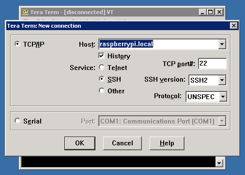

## <a name="connect-air">SORACOM Air の接続方法</a>
ここでは、SORACOM Air を使って、Raspberry Pi をインターネット接続する方法を説明します。大まかな流れとしては、

- Raspberry Pi にSSHでログインする
- 接続に必要なパッケージ・スクリプトをインストールする
- Raspberry Pi に SORACOM Air SIM を刺したUSBドングルを接続する
- 接続スクリプトを実行する

といった順番となります。

### 準備
- Raspbian が動作している Raspberry Pi
- 3G USB ドングル (FS01BU または AK-020)
- 登録済みの SORACOM Air SIM
- インターネット接続(Raspberry Piの有線LAN端子経由、またはスマホ等でのテザリング)

### Raspberry Pi への SSH ログイン
Raspberry Pi へ SSH を使ってログインします。
ユーザ名とパスワードは、それぞれ pi / raspberry になります。
接続先のアドレスは、以下のように調べます。

#### 有線LANを利用している場合
以下のいずれかであれば、Raspberry Pi のIPアドレスが分からなくてもログインが可能です。

- Mac を使用している
- Linux 等でAvahiデーモンが動作している
- Windows で Bonjour サービスをインストールしている(iTunesのインストールでもOK)
- Windows10 で mDNS を有効にしている

上記の場合、raspberrypi.local というホスト名でLANに接続された Raspberry Pi に接続が出来ます。

もし上記に該当しない場合、HDMIケーブルを使ってPCモニターやテレビなどに Raspberry Pi を接続し、下記のように画面上に表示される IP アドレスを確認する事が出来ます。

```
My IP address is 192.168.1.xxx
```

#### ハンズオン会場等で既に Raspberry Pi がセットアップされている場合

SORACOMが実施するハンズオンでは、事前にOSを初期化した Raspberry Pi を用意してあります。 割り当てられたRaspberryPiと、そのIPアドレスをご確認ください。

> 使用する Raspberry Pi のアドレスは、 192.168.123.(100+ドングルの番号) です
>
> 例: ５番のドングルであれば、 192.168.123.105

#### 接続
接続先がわかったら、自分の端末からRaspberry Piに接続(SSH)します。

MacやLinuxの場合には、ターミナルを立ち上げ、以下のコマンドを実行してください。

```
~$ ssh pi@192.168.123.xxx (割り当てられたIPアドレスを指定してください)
The authenticity of host '192.168.123.xxx (192.168.123.xxx)' can't be established.
ECDSA key fingerprint is db:ed:1b:37:f2:98:c6:f4:d8:6d:cf:5c:31:6a:16:58.
Are you sure you want to continue connecting (yes/no)? yes
Warning: Permanently added '192.168.123.xxx' (ECDSA) to the list of known hosts.
pi@192.168.123.3's password: (raspberry と入力)

The programs included with the Debian GNU/Linux system are free software;
the exact distribution terms for each program are described in the
individual files in /usr/share/doc/*/copyright.

Debian GNU/Linux comes with ABSOLUTELY NO WARRANTY, to the extent
permitted by applicable law.
Last login: Thu Sep 24 15:51:43 2015 from 192.168.123.254
pi@raspberrypi ~ $
```

Windowsの場合は、[TeraTerm](https://osdn.jp/projects/ttssh2/)を使用するといいでしょう。

パッケージをダウンロードしてインストールした後、プログラムを立ち上げて以下のように接続先を指定して接続します。



### 必要なパッケージのインストール
USBドングルを使用するために、以下のパッケージをインストールし、RaspberryPiをセットアップします。

-	usb-modeswitch
-	wvdial

#### usb-modeswitchとwvdialのインストールコマンド
```
pi@raspberrypi:~ $ sudo apt-get install -y usb-modeswitch wvdial
```
>  パッケージのインストール中、  
>  Sorry.  You can retry the autodetection at any time by running "wvdialconf".  
>     (Or you can create /etc/wvdial.conf yourself.)  
と表示されますが、設定ファイル /etc/wvdial.conf は後ほど実行するスクリプトが自動生成しますので、問題ありません。

### 接続スクリプトのダウンロードと実行
