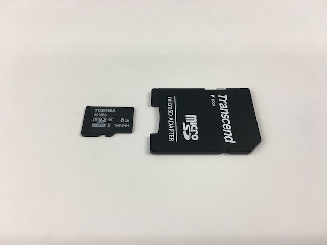
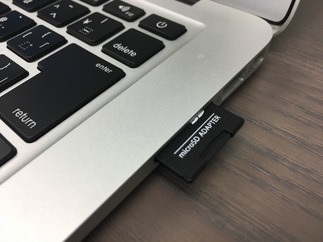
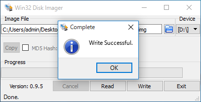

## <a name="raspbian-install">Raspbian のインストール</a>
### Raspbian とは
Raspberry Pi で使用する事ができる OS は様々なものがありますが、最も多く使われているのは、[Raspbian](https://www.raspbian.org) と呼ばれる Raspberry Pi での動作に最適化された Debian ベースの Linux です。

SORACOMのハンズオンでは、特に理由がない限りは Raspbian を利用する前提でスクリプトや手順が作られています。ここでは、Raspbian のインストール(MicroSDへの書き込み)方法について、解説します。

### 準備
必要なものは以下となります。
- PC(Mac、Windowsなど)
- SDカードリーダー/ライター (PC本体にSDスロットがある場合には不要)
- Micro SD カード (8GB以上が望ましい)  
 ※もし初代Raspberry Piを利用する場合には、通常サイズのSDカードを用意して下さい

### OSイメージファイルのダウンロード
Raspbian は、デスクトップGUI環境を含む通常版と、CUIのみのLite版があります。  
本ハンズオンでは Raspberry Pi にキーボードやマウスを接続して操作を行わないので、Lite版を利用します。

Raspbian Lite の イメージは、下記URLのミラーサイトからダウンロードするとよいでしょう。  
http://ftp.jaist.ac.jp/pub/raspberrypi/raspbian_lite/images/

- [2016-05-27バージョン(292MB)](http://ftp.jaist.ac.jp/pub/raspberrypi/raspbian_lite/images/raspbian_lite-2016-05-31/2016-05-27-raspbian-jessie-lite.zip) をダウンロード
- zipファイルを解凍して、イメージファイル(2016-05-27-raspbian-jessie-lite.img)を取り出す

### イメージの書き込み(Macの場合)
##### SDカードの接続
PC本体にSDカードスロットがある場合には、変換アダプタを介して接続して下さい。
   
もしPC本体にSDカードスロットがない場合には、USB接続カードリーダー/ライターなどを使って接続して下 さい。


##### disk番号の確認
接続をしたら、ターミナルを起動して diskutil list というコマンドを実行します。

```
~$ diskutil list
(略) :
/dev/disk4 (external, physical):
   #:                       TYPE NAME                    SIZE       IDENTIFIER
   0:     FDisk_partition_scheme                        *15.6 GB    disk4
   1:                 DOS_FAT_32 NO NAME                 15.6 GB    disk4s1
```

この場合、容量やフォーマットから disk2 がSDカードである事がわかります。環境によって disk3 であったり disk4 であったりする事がありますので、適宜読み替えて下さい。

> 注意： もし誤って disk0 や disk1 に書き込んでしまった場合、OSが起動で きなくなったりする可能性がありますので、十分注意して下さい

##### イメージファイルの書き込み
diskの番号が確認できたら、パーティションをマウント解除し、disk全体にイメージを書き込みます。 書き込みが終わったら eject して、SDカードを取り外します。

```
~$ diskutil unmount disk4s1
Volume NO NAME on disk4s1 unmounted
~$ cd Downloads (イメージファイルを解凍した場所mに応じて読み替えてください)
~/Downloads$ sudo dd if=2016-05-27-raspbian-jessie-lite.img of=/dev/rdisk4 bs=1m
Password: (パスワードを打ち込む)
1048576 bytes transferred in 0.427695 secs (2451691 bytes/sec)
1323+0 records in
1323+0 records out
1387266048 bytes transferred in 128.769184 secs (10773277 bytes/sec)
~/Downloads$ diskutil eject disk4
Disk disk4 ejected
```

### イメージの書き込み(Windowsの場合)
#### SDカードの接続
PC本体にSDカードスロットがない場合には、USB接続カードリーダー/ライターなどを使って接続して下 さい。


#### Win32 Disk Imager のインストール
[Win32 Disk Imager](https://osdn.jp/projects/sfnet_win32diskimager/)のサイトから、インストーラーをダウンロード・実行します。

#### イメージファイルの書き込み
Win32 Disk Imager を起動し、右上のDeviceがSDカードのドライブ名である事を確認します。  
ドライブ名の左のボタンを押し、イメージファイルの場所を指定します。  
Write を押すと、SDカードへの書き込みが開始されます。


しばらくして、Write Successful. と表示されれば、書き込み完了です。

